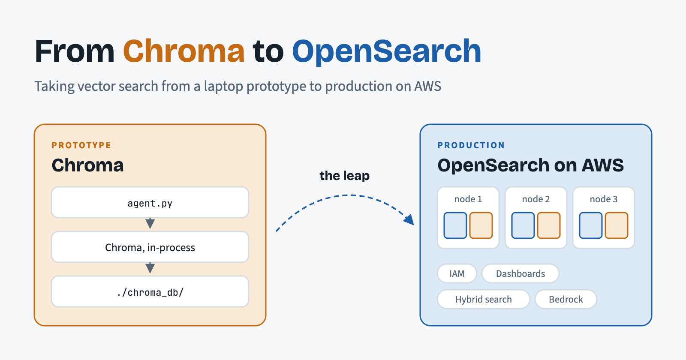
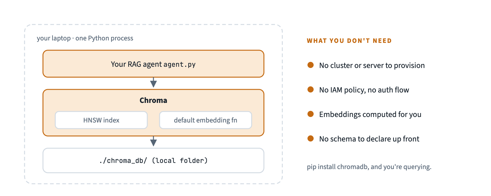
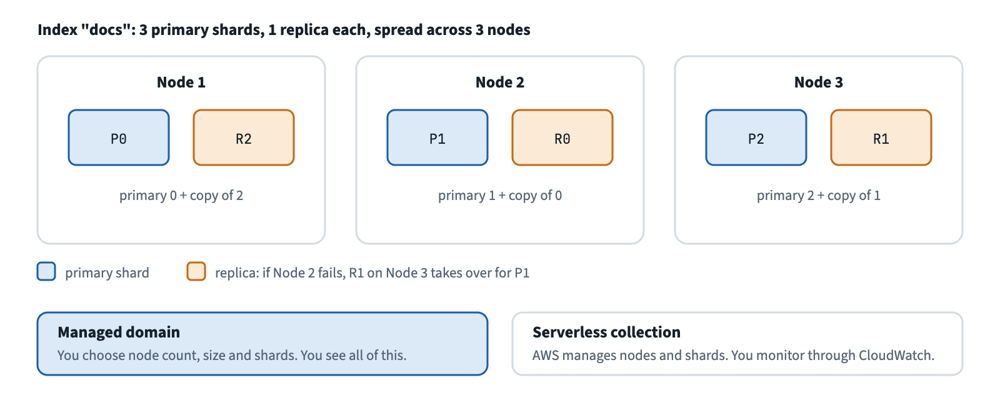
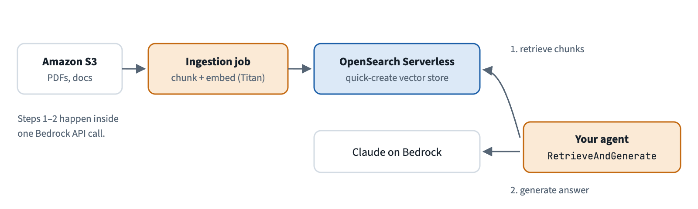
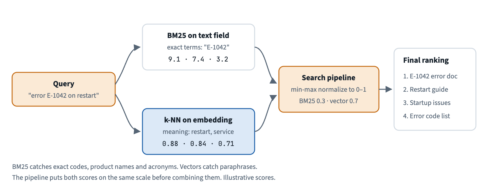
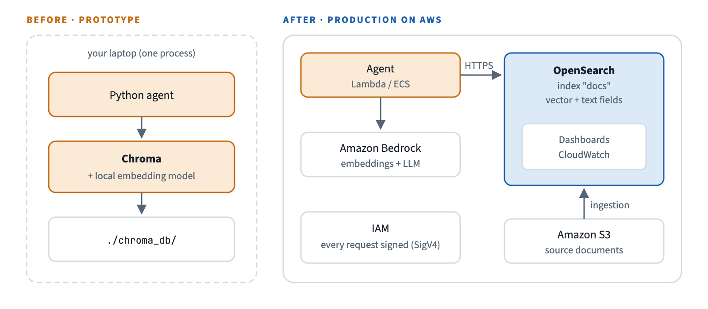
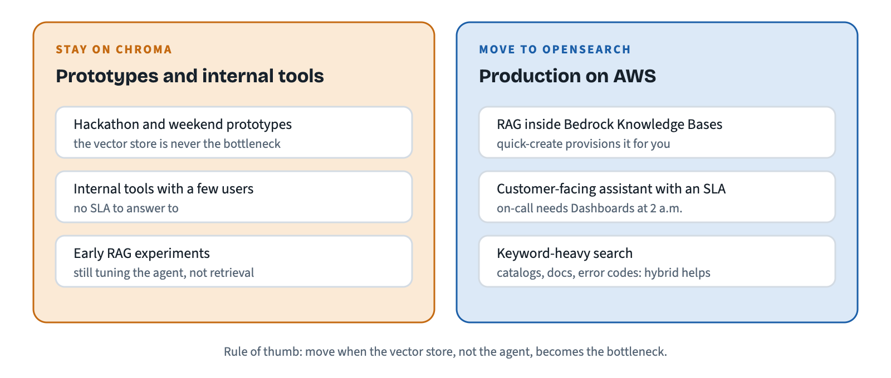

# From Chroma to OpenSearch: A Practical Guide to Taking Vector Search to Production on AWS

*Chroma gets you a working prototype in five minutes; shipping it on AWS is a different problem. This is our migration story — code, pricing, and latency included.*



We prototyped our RAG pipeline in Chroma because it took five minutes to get running. Then we had to ship it — and that's when we found out "five minutes to get running" and "ready for production on AWS" are two completely different problems.

That gap is what this article is about. Not "Chroma bad, OpenSearch good" — a practical account of what actually changed in our code, our bill, and our ops story when we made that jump.

**TL;DR:** Chroma is the fastest path from zero to a working vector search prototype — it's free, embedded, and gets out of your way. OpenSearch is a distributed search engine with a k-NN plugin bolted on, which means you inherit a real GUI (Dashboards), built-in hybrid search (BM25 + vector, combined by a search pipeline), and a direct line into Bedrock Knowledge Bases — at the cost of a higher operational floor and a real migration when you cross over. If you're building an agent whose RAG layer needs to survive contact with production traffic on AWS, the leap is usually worth it. If you're still iterating on the agent itself, stay on Chroma until the vector store stops being the bottleneck.

## Why Chroma Wins the Prototype Phase

Chroma is open-source (Apache 2.0 — genuinely free, self-hostable, no asterisk) and embeddable: it runs in-process or as a lightweight local server, with an HNSW index doing the approximate nearest-neighbor search. There's no cluster to provision and no IAM policy to write before your first query.

```python
# pip install chromadb
import chromadb

client = chromadb.PersistentClient(path="./chroma_db")
collection = client.get_or_create_collection("docs")

collection.add(
    ids=["1", "2"],
    documents=[
        "To restart the service, run systemctl restart app",
        "Vacation requests need 15 days' notice",
    ],
)

results = collection.query(query_texts=["how do I restart the app?"], n_results=1)
print(results)
```

Here is what the companion repo's `notebooks/01_chroma_setup.ipynb` printed when we ran it with Titan Text Embeddings V2 vectors (excerpt, captured verbatim):

```text
{'q01': {'kind': 'keyword',
         'text': 'What does error E-1042 mean?',
         'retrieved': ['kb-001', 'kb-002', 'kb-031'],
         'distances': [0.4946, 0.6543, 0.6694],
         'relevant': ['kb-001'],
         'recall@3': 1.0},
 'q02': {'kind': 'keyword',
         'text': 'PayFlow E-3007',
         'retrieved': ['kb-031', 'kb-033', 'kb-032'],
         'distances': [0.3276, 0.7383, 0.749],
         'relevant': ['kb-031'],
         'recall@3': 1.0},
 ...}
mean recall@3 [keyword ] = 1.00  (n=5)
mean recall@3 [semantic] = 1.00  (n=5)
mean recall@3 [mixed   ] = 1.00  (n=5)
```

Notice what's missing: we never computed an embedding. Chroma ships a default embedding function — a small model that runs locally — and applies it on every `add` and `query`. That's a big part of why it feels like five minutes, and it's the first convenience you lose when you leave.



That's the entire setup. No cluster, no shards, no auth flow — which is exactly why it was the right tool for the first weeks of building our agent's RAG layer, and exactly why it stopped being the right tool the moment we needed to answer "is this healthy in production?"

## Where It Falls Short for Production

Three things bit us, in this order:

1. **No built-in GUI.** Open-source Chroma is code-first. To see what's actually in a collection — how many vectors, what the distance distribution looks like, whether a query is slow because of the index or because of I/O — we wrote our own inspection scripts. Chroma Cloud now has a web UI; if you're evaluating it, confirm its current feature set before you plan around it, since this moves fast.

2. **No observability out of the box.** "Is this healthy?" isn't a question Chroma answers for you. It can export OpenTelemetry traces, but you wire up the backend and build the dashboards yourself. There's no health metric or dashboard your on-call can glance at during an incident unless you build it.

3. **No horizontal scaling in the single-node version.** Open-source, single-node Chroma scales by giving it a bigger machine. That's fine until it isn't, and there's no sharding or replication to reach for when it isn't. Chroma does have a distributed architecture — it's what runs Chroma Cloud — but that's a managed product, not something you get from `pip install`.

None of these are bugs — Chroma isn't trying to be a production search cluster. They're just the reasons the leap became necessary for us.

## What OpenSearch Gives You Instead

OpenSearch didn't start as a vector database — it's a distributed search engine (the Elasticsearch/Lucene lineage) with a k-NN plugin added on top. An index is split into shards, the shards are spread across nodes, and each shard has a replica on another node. That lineage is exactly what you're buying when you migrate.



One distinction that matters from here on: Amazon OpenSearch Service comes in two flavors. **Managed domains**, where you choose node types, node count and shards, and **OpenSearch Serverless**, where you create a *collection* and AWS handles nodes and shards for you. Our examples use Serverless, because that's what Bedrock Knowledge Bases provisions.

* **OpenSearch Dashboards**, the Kibana fork, comes with both — including Dev Tools, a query console you didn't have to build. On a managed domain you also get cluster health and shard status. On Serverless, nodes and shards are hidden, so health and performance monitoring lives in CloudWatch instead.

* **Hybrid search.** Because full-text (BM25) search was already the core engine, a `hybrid` query can combine keyword matching and vector similarity. A search pipeline with a normalization processor (OpenSearch 2.10+) puts both scores on the same scale and weights them. We ran exactly that on a NextGen Serverless collection and it worked. Open-source Chroma doesn't ship BM25 ranking: you can filter by text with `where_document`, but real hybrid ranking is something you'd build yourself. (Chroma Cloud now offers full-text and hybrid search, worth a look if you're staying in that ecosystem.)

* **A direct line into Bedrock.** When you create a Knowledge Base with the quick-create option in the Bedrock console, Bedrock provisions an OpenSearch Serverless collection for you and fills it. It isn't the only supported store — Aurora PostgreSQL, Pinecone, Redis Enterprise Cloud, MongoDB Atlas, Neptune Analytics and Amazon S3 Vectors are on the list too — but if your agent's RAG layer is going to live inside Bedrock, OpenSearch is the path of least resistance.



`[VERIFY BEFORE PUBLISHING]` — re-check the current list of vector stores that Bedrock Knowledge Bases supports.



Here's the same flow as the Chroma snippet, against OpenSearch Serverless:

```python
import json
import boto3
from opensearchpy import OpenSearch, RequestsHttpConnection
from requests_aws4auth import AWS4Auth

REGION = "us-east-1"
HOST = "your-collection-id.us-east-1.aoss.amazonaws.com"

# 1. Sign every request with SigV4 ("aoss" = Serverless, "es" = managed domain)
creds = boto3.Session().get_credentials()
auth = AWS4Auth(creds.access_key, creds.secret_key, REGION, "aoss",
                session_token=creds.token)
client = OpenSearch(hosts=[{"host": HOST, "port": 443}], http_auth=auth,
                    use_ssl=True, connection_class=RequestsHttpConnection)

# 2. Compute embeddings yourself (here: Titan Text Embeddings V2, 1024 dimensions)
bedrock = boto3.client("bedrock-runtime", region_name=REGION)

def embed(text):
    resp = bedrock.invoke_model(modelId="amazon.titan-embed-text-v2:0",
                                body=json.dumps({"inputText": text}))
    return json.loads(resp["body"].read())["embedding"]

# 3. Declare the schema before indexing anything
client.indices.create(index="docs", body={
    "settings": {"index.knn": True},
    "mappings": {"properties": {
        "text": {"type": "text"},                    # used by BM25
        "embedding": {"type": "knn_vector",          # used by k-NN
                      "dimension": 1024,
                      # No "engine" key: NextGen collections reject it and pick one themselves
                      "method": {"name": "hnsw", "space_type": "cosinesimil"}},
    }},
})

# 4. Index and query with the Query DSL
for text in ["To restart the service, run systemctl restart app",
             "Vacation requests need 15 days' notice"]:
    client.index(index="docs", body={"text": text, "embedding": embed(text)})

results = client.search(index="docs", body={
    "size": 1,
    "query": {"knn": {"embedding": {"vector": embed("how do I restart the app?"), "k": 1}}},
})
```

This is what `notebooks/02_opensearch_setup.ipynb` printed against a NextGen Serverless collection, after reading the mapping back from the index (captured verbatim):

```text
{'compression_level': '32x',
 'dimension': 1024,
 'method': {'engine': 'faiss',
            'name': 'hnsw',
            'parameters': {},
            'space_type': 'cosinesimil'},
 'mode': 'on_disk',
 'type': 'knn_vector'}
indexed: 51, errors: []
searchable docs: 51/51
queries with identical top-3 order in Chroma and OpenSearch: 15/15
```

Two things in that output surprised us. We asked for `engine: faiss` and the service rejected it (`Field parameter 'engine' is not supported`), yet the mapping it created reports `faiss`: NextGen collections choose the engine, the compression (`32x`) and the mode (`on_disk`) for you. And because both stores searched the same vectors, OpenSearch returned the same top three as Chroma for all 15 queries.

`[SCREENSHOT PLACEHOLDER]` — OpenSearch Dashboards, showing the `docs` k-NN index in Dev Tools with a live query result. Capture this after running the notebook above.

Notice the shape of the code is genuinely different, not just relabeled: Chroma's API is `add`/`query` against a collection; OpenSearch's is authentication, index management (mappings, settings), embeddings you compute yourself, and a query DSL. You're not swapping a client library — you're adopting a different mental model.

## Architecture, Before and After

Before, everything lived in one Python process on a laptop: the agent, Chroma, its default embedding model, and a local folder. After, the same responsibilities are split into separate AWS services that talk over the network — the agent runs on Lambda or ECS, Bedrock computes embeddings and generates answers, OpenSearch stores and searches the vectors, S3 holds the source documents, and IAM sits in front of all of it.



## The Real Cost of the Leap

### Code

The migration isn't a find-and-replace. You're moving from a flat `add`/`query` call to explicit index mappings, from local persistence to an authenticated AWS endpoint (SigV4, via `AWS4Auth`), and from automatic embeddings to an embedding step you own. That last one has a consequence that's easy to miss: the vector dimension is fixed in the mapping, so changing embedding models means reindexing everything. Budget real time for this in your migration plan — it's not a config change.

Moving the data itself isn't an export/import either. You either re-embed the original documents with the new model, or read them back from Chroma (`collection.get(include=["documents", "embeddings", "metadatas"])`) and bulk-index them, as long as the dimension matches the mapping.

### Price

Chroma on a laptop costs nothing; on a small EC2 instance, you pay for the instance and you operate it. OpenSearch Serverless bills per OCU-hour (OpenSearch Compute Units, split between indexing and search) plus storage. What you pay when nobody is querying depends on the collection type. **Classic** collections keep a minimum number of OCUs running at all times, so you pay that floor with ten documents or ten million. **NextGen** collections in a collection group can scale to zero after 10 minutes without traffic and stop billing compute, at the price of a 10–30 second wait on the first request after idle (AWS's figure; on a freshly created collection our first request took 2.0 s, and we did not wait out the 10 idle minutes to time a true wake-up). At prototype scale, a small managed domain can also come in lower, in exchange for sizing and operating the nodes yourself.

`[VERIFY BEFORE PUBLISHING]` — confirm current OpenSearch Serverless OCU pricing and minimums (Classic production vs. dev/test, and NextGen scale-to-zero) on the AWS Pricing Calculator before this goes live; it's the kind of number that goes stale fast.

### Time

Two different clocks matter here, and they point in opposite directions:

* **Time to first query:** Chroma wins by a wide margin — `pip install`, no cluster to provision. OpenSearch needs a collection or domain stood up (and, if you're going through Bedrock Knowledge Bases, an ingestion job) before your first query lands.

* **Query latency:** it depends mostly on where the client sits. We measured it with the companion repo's `benchmark.py`: 15 queries, 20 timed runs each, two untimed warm-up passes, from a laptop to `us-east-1`.

| mode | p50 ms | p95 ms | recall@3 |
|---|---|---|---|
| Chroma, k-NN (in-process) | 1.31 | 3.80 | 1.00 |
| OpenSearch, BM25 | 169.26 | 185.26 | 0.67 |
| OpenSearch, k-NN | 168.11 | 195.80 | 1.00 |
| OpenSearch, hybrid (server-side) | 166.99 | 183.03 | 1.00 |
| OpenSearch, hybrid (two queries, merged client-side) | 326.17 | 339.58 | 1.00 |

Read this table carefully, because it is easy to over-read. Chroma runs inside our process, so its 1.3 ms has no network in it. OpenSearch's ~167 ms is almost entirely the round trip from a laptop to the AWS region plus request signing; the three server-side modes are within noise of each other. Run the client from inside AWS and that number changes a lot. What the table does show is that a server-side hybrid query cost us nothing extra over plain k-NN, while merging two queries on the client took about twice as long because it is two round trips.

On quality, we expected hybrid to win and it didn't, at least on this dataset. With Titan V2 vectors, plain k-NN already reached recall@3 of 1.00 on all 15 queries, including the ones built around exact error codes like `E-1042`. BM25 alone scored 0.00 on the five paraphrased queries. Our 51-document corpus is small and clean, so it can't show the case where hybrid earns its keep: a large, noisy corpus where an exact term gets buried among thousands of semantically similar chunks. We'd rather tell you that than claim a win we didn't measure.

## What Broke When We Ran It on AWS

The repo was written before we ran it against a real account, and a real run found problems that no amount of reading would have:

* **`--standby-replicas DISABLED` is rejected for NextGen collection groups.** The CLI returns a `ValidationException`. NextGen groups need `ENABLED`.
* **`engine: faiss` is rejected in the mapping.** NextGen picks the engine itself (see the output above), so the explicit key has to go.
* **Cost visibility is on you.** Serverless bills per OCU-hour, and a Classic collection with redundancy keeps two OCUs on around the clock. While cleaning up after this project we found a Classic collection that had been running for 31 days, about $350 of compute, covered by credits but wasted all the same. Set a budget alert before you create the first collection, not after.
* **The teardown needs to be tested too.** Deleting an index doesn't stop billing; deleting the collection does. Our `teardown.sh` removes the collection, the collection group and the three policies, and running it a second time just reports "not found".

## Checklist: When to Actually Make the Leap

**Stay on Chroma if:**

* You're still iterating on the agent's reasoning, not the retrieval layer.
* Your dataset fits comfortably on one machine and query volume is low or spiky.
* You don't yet have a concrete production deadline.

**Make the leap to OpenSearch if:**

* Your RAG layer is going into Bedrock Knowledge Bases (OpenSearch Serverless is the quick-create option there — adopting it costs less than fighting it).
* You need hybrid (keyword + vector) search, or you're not sure yet which one your queries need.
* On-call needs a dashboard to look at during an incident, not a Python REPL.

## Where Each One Actually Earns Its Keep: Project Types

Not every project needs to make this leap — knowing which side you're on before you start saves you the whole migration later. Here's how we sort our projects:



**Where Chroma has been the right call for us:**

* Hackathon or weekend prototypes, where the vector store is never going to be the bottleneck — our weekend hackathon FAQ bot
* Internal tools with a handful of users and no SLA to answer to — a docs assistant for our own team
* Early-stage RAG experiments where we're still iterating on the agent's reasoning, not its retrieval layer — the first version of our support agent

**Where OpenSearch is the right call (or where we'd reach for it next):**

* Anything going into Bedrock Knowledge Bases in production — the quick-create path provisions it for you, and fighting the default costs more than adopting it.
* A customer-facing RAG assistant with real traffic and an actual SLA — on-call needs Dashboards, not a Python REPL, when something breaks at 2 a.m.
* A project where users search with real keywords, not only semantic phrasing — a product catalog or docs search, where hybrid (BM25 + vector) can change result quality, not just latency (our small test corpus did not show it, a larger one is where we would look) — the product catalog search we're planning next

## Try It Yourself

The companion repo has both setups against the same dataset and the same query set, so you can reproduce every number in this article instead of taking our word for it.

**[github.com/carlicode/chroma-to-opensearch](https://github.com/carlicode/chroma-to-opensearch)**

## Conclusion

Chroma and OpenSearch aren't competing for the same job. Chroma optimizes for the five minutes right after you have an idea; OpenSearch optimizes for the year after you ship it. The leap is real work — a new mental model, a new auth flow, embeddings you now own, a different cost model — but if your agent's RAG layer is heading into Bedrock anyway, it's work you're going to do eventually. The only question this article is really answering is when.

Have you made this jump yourself? What broke for you that isn't on this list? We'd genuinely like to know for the next revision.
